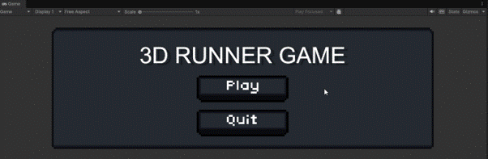
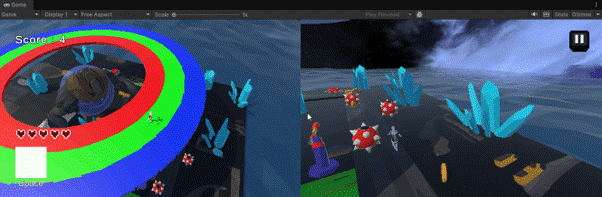
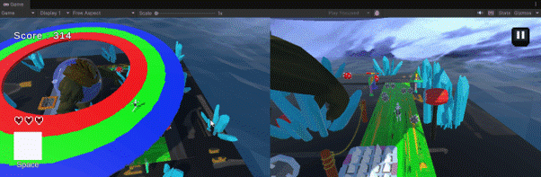
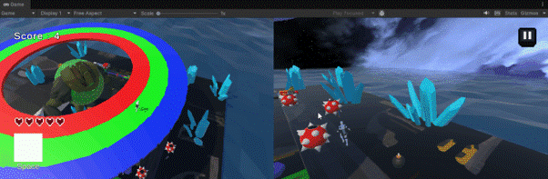
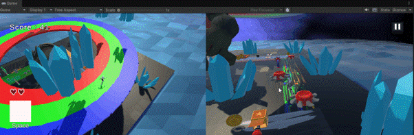

# Project ShiftRunner

## 소개 및 용도

Project ShiftRunner는 Unity로 개발된 3D 러닝 게임입니다.

## 팀원

| 조원 | 역할 |
| --- | :---: |
| 김동우 (팀장) | 오브젝트 배치 및 보스/장애물 구현 |
| 조승빈 | 아이템 시스템 개발, 주차별 작업물 병합 |
| 김인하 | 플레이어 이동 시스템 개발 |
| 지시현 | 플레이어 체력/점수 시스템, UI 개발 |

## 개발 환경

- UnityVersion - `6000.4.6f1`
- Render Pipeline: `Universal RP`
- Target Platform: PC
- Version Control: `Git Flow` branching strategy

## 시작하기

- GitHub 저장소에서 프로젝트를 클론합니다.
  
``` plain
git clone https://github.com/OpenSourceGameProject/ProjectRunner.git
```

- Unity Hub - Add - Add Project from disk - 프로젝트 폴더 선택
- `Assets/.../Start Scene.unity` 씬을 열고 플레이 버튼을 눌러 게임을 시작합니다.

  (프로젝트 실행 파일만 필요한 경우, [여기](https://drive.google.com/file/d/1bMW2ZPnnlrvIn66zKcW97hG9xGUOs8pM/view?usp=sharing)에서 최신 빌드 버전을 다운로드하여 실행할 수 있습니다.)

## 주요 기능 및 사용 방법

### 주요 구현 기능

- 원형 맵 1,2층 개발 및 각종 오브젝트 배치, 보스 / 장애물 시스템 개발 및 플레이어와 트랙 색깔이 맞는지 판별하는 시스템 구현
- 플레이어 이동, 점프, 슬라이딩 구현 및 플레이어 시점을 따라가는 카메라 개발, 플레이어 속도 증가 시스템으로 난이도 상승 구현 
- 아이템 3종 (코인, 쉴드, 폭탄) 시스템 기초 코드 작성, 아이템 효과 개발 및 작업 내용 병합 구현
- 플레이어 체력, 점수 시스템 개발 및 관련 UI 배치, 게임시작 / 게임오버 관련 UI 구현

### 사용 방법

1. 게임 시작 후 메인 타이틀(Start Scene)에서 Play 버튼을 눌러 인게임 화면으로 진입합니다.


2. 1층은 화살표, 2층은 wasd 방향키 입력을 이용하여 장애물을 피하며 달려갑니다.


3. 2층에서는 플레이어가 보스의 색깔과 트랙의 색을 시간 내에 일치시키지 못하면 체력이 감소합니다.


4. 플레이어와 장애물이 충돌 시 체력이 1 감소합니다.


5. 코인은 추가 점수를 얻고, 쉴드(space bar 사용)으로 장애물 충돌을 막으며, 폭탄으로 장애물을 파괴합니다.


6. 게임 중 우측 상단의 일시정지 버튼을 누르거나 ESC 키를 누르면 일시정지 메뉴가 나타납니다. (계속하기 / 홈으로 가기)


7. 하트가 모두 소진되면 게임 오버 화면이 나타나며 최고 점수가 자동 갱신됩니다. (다시하기 / 종료하기)


### 프로젝트 구조

``` plain
Assets/
├── 01. Scenes/     # 타이틀, 인게임, 로딩 씬
├── 02. Scripts/    # 게임 스크립트
├── 03. Prefabs/    # 플레이어, 장애물, 아이템 프리팹
├── 04. Images/     # 게임 이미지
├── 05. Models/     # 자체 3D 모델 (미사용)
├── 06. Sounds/     # 게임 사운드
└── 07. Animations/ # 애니메이션 클립
... (기타 서드파티 에셋 및 폴더)
```

### 빌드 및 배포

- Unity Editor의 File - Build Settings에서 PC 플랫폼 선택
- 필수 씬(Start Scene, Game Scene)을 빌드에 반드시 추가
- Build 버튼을 눌러 빌드 폴더에 실행 파일 생성
- 생성된 실행 파일을 테스트 후, 실행 파일과 데이터 폴더를 압축하여 배포

### 라이선스

- [MIT License](https://opensource.org/licenses/MIT)
- 프로젝트에 사용된 모든 코드는 MIT 라이선스에 따라 자유롭게 사용할 수 있습니다.

  (단, 프로젝트 내에서 사용된 서드파티 에셋은 해당 에셋의 라이선스 조건을 따릅니다.)
